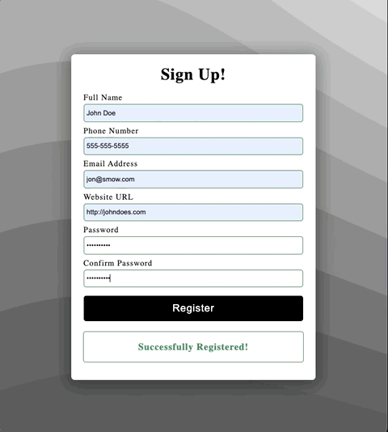

# Form Validation with JS

## About The Project
This is a frontend sign up/register form validation project. We have different types of input fields and if some or none is complete you'll get a warning indication to fill in the required inputs. This also applies to the password input. Incase your password confirmation password in not matched, you won't be able to register.  
The email field will need to have the "@" character. Website url field will need to have "url" format. A password will require 8 characters, one capital letter and one number. 
Once all the fields are filled in and validated with an indication of green outline, you'll be able to register. A message at the bottom will display 'Successfully Registered', else it will display a message that requires the correct input. 
This project is intended for anyone who wants to learn the methods applied with vanilla JavaScript. Once again, this is a frontend UI, so in the real world you'll be sending your object to your preferred DB.

## Preview

## Built With
- [HTML forms](https://www.w3schools.com/html/html_forms.asp)
- [Input Element](https://developer.mozilla.org/en-US/docs/Web/HTML/Element/input)
- [CSS :valid pseudo class](https://developer.mozilla.org/en-US/docs/Web/CSS/:valid)
- [Form Validation](https://developer.mozilla.org/en-US/docs/Learn/Forms/Form_validation)
- [Constraint Validation](https://developer.mozilla.org/en-US/docs/Web/Guide/HTML/Constraint_validation)
- [HTML Basic Data Validation](https://html.com/attributes/input-pattern/)
- [Submit Event](https://developer.mozilla.org/en-US/docs/Web/API/HTMLFormElement/submit_event)
- [preventDefault()](https://www.w3schools.com/jsref/event_preventdefault.asp)
- [CSS tricks](https://css-tricks.com/form-validation-part-1-constraint-validation-html/)

## Installation

This is a working code example.
You can copy the CSS and Javascript code as is and use it in your projects.
Or you can download the code as a ZIP file and unzip it. No web server required, you can see it live through your localhost by opening index.html with your browser. Alternatively, you can open your project with VS Code (download live server extension) and click on **Go Live** at the bottom right corner, it should open in your default browser.

## Contributing

1. Fork the Project
2. Create your Feature Branch (`git checkout -b feature/AmazingFeature`)
3. Commit your Changes (`git commit -m 'Add some AmazingFeature'`)
4. Push to the Branch (`git push origin feature/AmazingFeature`)
5. Open a Pull Request

## License

MIT License

Copyright (c) 2021 Shay Asanova

Permission is hereby granted, free of charge, to any person obtaining a copy
of this software and associated documentation files (the "Software"), to deal
in the Software without restriction, including without limitation the rights
to use, copy, modify, merge, publish, distribute, sublicense, and/or sell
copies of the Software, and to permit persons to whom the Software is
furnished to do so, subject to the following conditions:

The above copyright notice and this permission notice shall be included in all
copies or substantial portions of the Software.

THE SOFTWARE IS PROVIDED "AS IS", WITHOUT WARRANTY OF ANY KIND, EXPRESS OR
IMPLIED, INCLUDING BUT NOT LIMITED TO THE WARRANTIES OF MERCHANTABILITY,
FITNESS FOR A PARTICULAR PURPOSE AND NONINFRINGEMENT. IN NO EVENT SHALL THE
AUTHORS OR COPYRIGHT HOLDERS BE LIABLE FOR ANY CLAIM, DAMAGES OR OTHER
LIABILITY, WHETHER IN AN ACTION OF CONTRACT, TORT OR OTHERWISE, ARISING FROM,
OUT OF OR IN CONNECTION WITH THE SOFTWARE OR THE USE OR OTHER DEALINGS IN THE
SOFTWARE.

## Contact

shay[dot]asanova[at]gmail[dot]com

